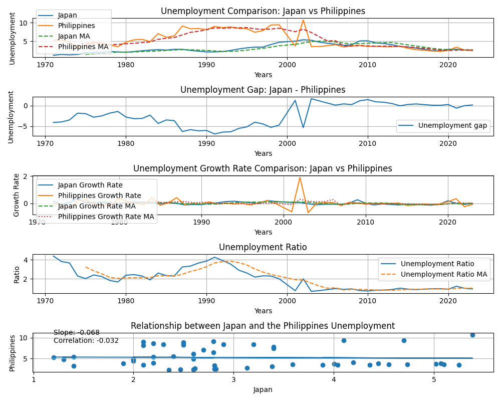

# japan-ph-unemployment-analysis
A Python project analyzing unemployment in Japan and the Philippines using real-world economic data.

## Tools Used
Python
pandas
matplotlib
numpy

## Features
Unemployment trend comparison
Moving averages
Growth rate analysis
Unemployment gap analysis
Ratio analysis
Correlation analysis
Scatter plot visualization

## Data Source
World Bank Open Data

## Key Findings
The Philippines generally experienced higher unemployment rates than Japan.
The unemployment gap between the two countries varied over time.
The correlation analysis helps evaluate whether labor market trends moved together.
Moving averages provide a clearer view of long-term unemployment trends.

## Visualization

## Future Improvements
Add ASEAN country comparisons
Examine youth unemployment rates
Investigate economic events affecting unemployment
Perform regression analysis with GDP growth and inflation
